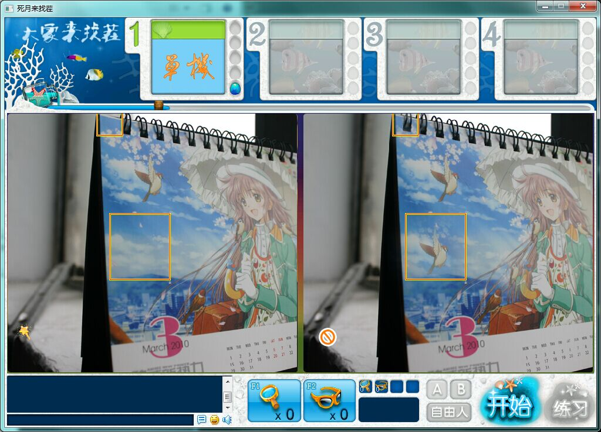
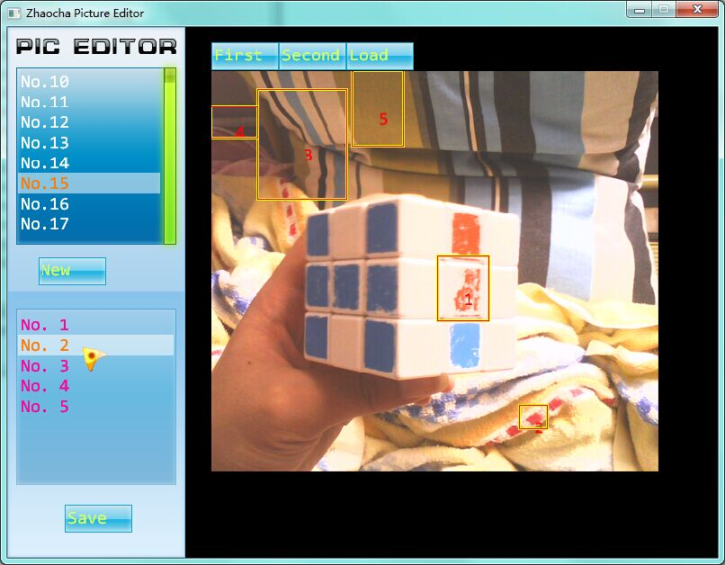

# 大家来找茬

> 年幼无知之作，码于 2010 年 10 月初学 HGE 游戏引擎之时，为 QQ 游戏大家来找茬的单机复刻版。其中资源版权所属为 QQ 游戏，资源仅供学习使用，不能用于商业用途。
>
> 原来我以前也是写过 C++ 的啊。(ゝ∀･)⌒☆

## 环境需求

  * Visual Studio 2012 及其 C++ 编译器
  * 貌似也没别的什么了...
  
## 编译

  与 [连连看](https://github.com/XadillaX/lianliankan#编译) 类似，请参照其文档。只不过该仓库有两个子项目需要编译，包括找茬源代码和找茬图片制作源代码。
  
## 资源打包

根据业务逻辑代码，资源可选择打成两个包。

将 `Ini`、`Texture`、`Sound` 打包成 Zip 文件，压缩解压密码为 `X2Studio`，并且重命名为 `GameRes.X2Pak`。

如果想要的话，可以顺便把 `ZhaoChaPicture` 打包到上面的文件当中。

然后将 `ZhaoChaUI` 文件夹打包为 `UI.X2Pak`，密码相同。

## 截屏

## 贡献

本仓库仅为年幼无知作品的一个存档，理论上不再维护了，代码自己看了也觉得很初级。

但是如果你真的有意愿做些什么的话还是很欢迎的，不过我基本上没在 Windows 上写代码了。